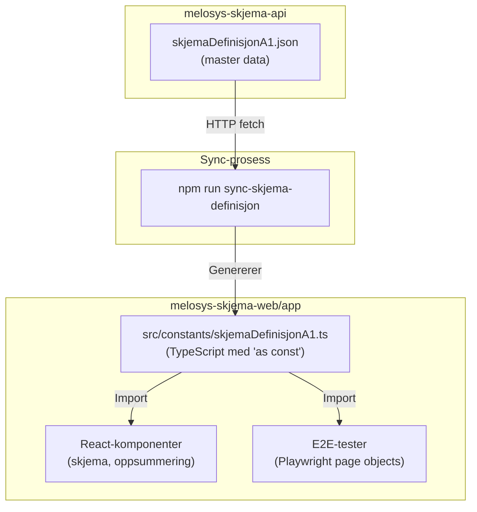

# Melosys Skjema Web

Web-applikasjon for digitale skjema for utsendt arbeidstaker (A1-søknad).

## Tech Stack

### Frontend (app/)
- **React 19.x** - UI framework med modern hooks
- **TypeScript 5.8.x** - Type safety og developer experience
- **TanStack Router 1.130.x** - File-based routing med type safety
- **TanStack Query 5.x** - Server state management og caching
- **Vite 7.x** - Build tool og dev server
- **NAV Designsystemet (Aksel)** - UI komponenter og ikoner
- **Tailwind CSS** - Utility-first CSS styling

### Backend (server/)
- **Express 5.x** - Web server framework
- **TypeScript 5.x** - Type safety på server-side
- **Node.js ESModules** - Modern JavaScript moduler
- **Winston 3.x** - Strukturert logging
- **Morgan 1.x** - HTTP request logging
- **NAV Oasis 3.x & Vite-mode 0.x** - NAV-spesifikke integrasjoner
- **NAV Dekoratøren 3.x** - NAV header/footer
- **Express Rate Limit 8.x** - API rate limiting

### Utviklingsverktøy
- **ESLint** - Code linting med strenge regler
- **Prettier** - Code formatting
- **Docker & Docker Compose** - Containerisering
- **OpenAPI TypeScript Generator** - Automatisk API type generering

## Utvikling

### Lokal utvikling mot ekte backend i dev-gcp

1. Start react app:
   ```bash
   cd app
   npm run dev
   ```

2. Åpne url i nettleser:
   https://melosys-skjema-web.intern.dev.nav.no/vite-on

### Lokal utvikling mot lokal backend med Q2-token

Forutsetter at [melosys-skjema-api](https://github.com/navikt/melosys-skjema-api) kjører lokalt på http://localhost:8089.

```bash
make get-token                    # Åpner nettleser for innlogging
export LOCAL_TOKEN="din-token"    # Kopier access_token fra JSON
make local-q2                     # Start server og app
```

Åpne http://localhost:4000/vite-on

**Merk:** Q2-token utløper etter ~1 time. Kjør `make get-token` for å hente nytt.

### Lokal utvikling med mock OAuth (Wonderwall)

Forutsetter at [melosys-skjema-api](https://github.com/navikt/melosys-skjema-api) kjører lokalt på http://localhost:8089 og at mock-oauth2-server i [melosys-docker-compose](https://github.com/navikt/melosys-docker-compose) kjører.

```bash
make local    # Start server og app med mock OAuth
```

Åpne http://localhost:4000/vite-on

### Kommandoer

**Frontend (app/):**
```bash
npm run dev            # Start dev server
npm run build          # Bygg for produksjon
npm run lint           # Kjør ESLint
npm run generate-types # Generer TypeScript-typer fra API
```

### Typegenerering

Applikasjonen bruker automatisk genererte TypeScript-typer fra API-et:

```bash
cd app
npm run generate-types
```

Dette kommandoen:
- Henter OpenAPI-spesifikasjonen fra melosys-skjema-api
- Genererer kun modell-typer (ikke API-kall)
- Lagrer typene i `./src/types/apiTypes.ts`

Kjør denne kommandoen når API-et har nye eller endrede datamodeller.

**Server (server/):**
```bash
npm run build        # Bygg TypeScript
docker-compose up -d --build  # Bygg og start server
npm run start        # Start bygget server
npm run lint         # Kjør ESLint
npm run lint:fix     # Fiks ESLint-feil
```

## Prosjektstruktur

```
app/                           # Frontend-applikasjon
├── src/
│   ├── routes/                # TanStack Router ruter
│   │   ├── __root.tsx         # Root layout med global scroll-til-topp
│   │   ├── index.tsx          # Hjem-side
│   │   ├── oversikt.tsx       # Oversiktsside (velg arbeidsgiver/arbeidstaker)
│   │   ├── arbeidsgiver/      # Arbeidsgiver-ruter
│   │   │   ├── index.tsx      # Arbeidsgiver landingsside
│   │   │   └── skjema.tsx     # Arbeidsgiver skjemaside
│   │   ├── arbeidstaker.tsx   # Arbeidstaker-side
│   │   └── skjema/            # Skjema-ruter (8-stegs prosess)
│   │       ├── index.tsx      # Skjema landingsside
│   │       ├── veiledning.tsx # Steg 1: Veiledning
│   │       ├── arbeidstakeren.tsx          # Steg 2: Arbeidstakeren
│   │       ├── arbeidsgiveren.tsx          # Steg 3: Arbeidsgiveren
│   │       ├── arbeidsgiverens-virksomhet-i-norge.tsx # Steg 4
│   │       ├── utenlandsoppdraget.tsx      # Steg 5: Utenlandsoppdraget
│   │       ├── arbeidstakerens-lonn.tsx    # Steg 6: Arbeidstakerens lønn
│   │       ├── du-som-fyller-ut-skjemaet.tsx # Steg 7: Du som fyller ut
│   │       └── oppsummering.tsx            # Steg 8: Oppsummering
│   ├── pages/                 # React komponenter for sider
│   │   ├── arbeidsgiver/      # Arbeidsgiver-komponenter
│   │   │   └── ArbeidsgiverPage.tsx
│   │   ├── arbeidstaker/      # Arbeidstaker-komponenter
│   │   │   └── ArbeidstakerPage.tsx
│   │   └── skjema/            # Skjema-komponenter
│   │       ├── Skjema.tsx     # Hovedskjema-komponent
│   │       ├── VeiledningSteg.tsx          # Steg 1 komponent
│   │       ├── ArbeidstakerenSteg.tsx      # Steg 2 komponent
│   │       ├── ArbeidsgiverSteg.tsx        # Steg 3 komponent
│   │       ├── ArbeidsgiverensVirksomhetINorgeSteg.tsx # Steg 4
│   │       ├── UtenlandsoppdragetSteg.tsx  # Steg 5 komponent
│   │       ├── ArbeidstakerensLonnSteg.tsx # Steg 6 komponent
│   │       ├── DuSomFyllerUtSkjemaetSteg.tsx # Steg 7 komponent
│   │       ├── OppsummeringSteg.tsx        # Steg 8 komponent
│   │       └── components/    # Delte skjema-komponenter
│   │           └── Fremgangsindikator.tsx  # Progress indikator
│   ├── components/            # Globale komponenter
│   │   ├── ScrollToTop.tsx    # Global scroll-til-topp komponent
│   │   └── SoknadHeader.tsx   # App header
│   ├── types/                 # TypeScript typer
│   │   └── apiTypes.ts        # Autogenererte API typer
│   ├── api/                   # API queries og mutations
│   │   └── queries.ts         # TanStack Query hooks
│   ├── main.tsx               # App entry point med router config
│   └── routeTree.gen.ts       # Autogenererte router typer
├── index.html                 # HTML template
├── package.json
├── package-lock.json
├── vite.config.ts
├── tsconfig.json
├── tsconfig.node.json
└── eslint.config.mjs

server/                        # Express server
├── src/
│   ├── actuators.ts           # Health/metrics endpoints
│   ├── config.ts              # Environment config
│   ├── errorHandler.ts        # Global error handling
│   ├── frontendRoute.ts       # Frontend routing logic
│   ├── index.ts               # Server startup
│   ├── logger.ts              # Winston logging setup
│   └── server.ts              # Express app setup
├── dist/                      # Compiled TypeScript output
├── Dockerfile                 # Docker container config
├── docker-compose.yaml        # Docker compose setup
├── package.json
├── package-lock.json
├── tsconfig.json
└── eslint.config.mjs
```

## Skjemadefinisjon-arkitektur

Skjemadefinisjoner (labels, valideringsregler, alternativer) kommer fra backend som én kilde til sannhet. Dette sikrer konsistens mellom frontend og backend, og muliggjør versjonering for etterlevelse.



### Synkronisering

```bash
cd app
npm run sync-skjema-definisjon
```

Dette henter skjemadefinisjonen fra backend og genererer `skjemaDefinisjonA1.ts` med full TypeScript-typing.

### Bruk i kode

```typescript
import { SKJEMA_DEFINISJON_A1, getFelt, getSeksjon } from "~/constants/skjemaDefinisjonA1";

// Hent seksjon
const seksjon = getSeksjon("utenlandsoppdragetArbeidsgiver");

// Hent felt med label
const felt = getFelt("arbeidsstedPaLand", "vegadresse");
console.log(felt.label); // "Vegadresse"

// Direkte tilgang for felter med alternativer
const alternativer = SKJEMA_DEFINISJON_A1.seksjoner.arbeidsstedIUtlandet.felter.arbeidsstedType.alternativer;
```

## Kodestandarder

- ESLint med strenge regler (Unicorn, React, import-sorting)
- Prettier for formatering
- TypeScript strict mode
- Ingen console.log i produksjonskode